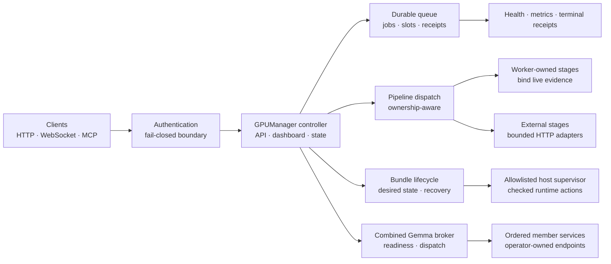
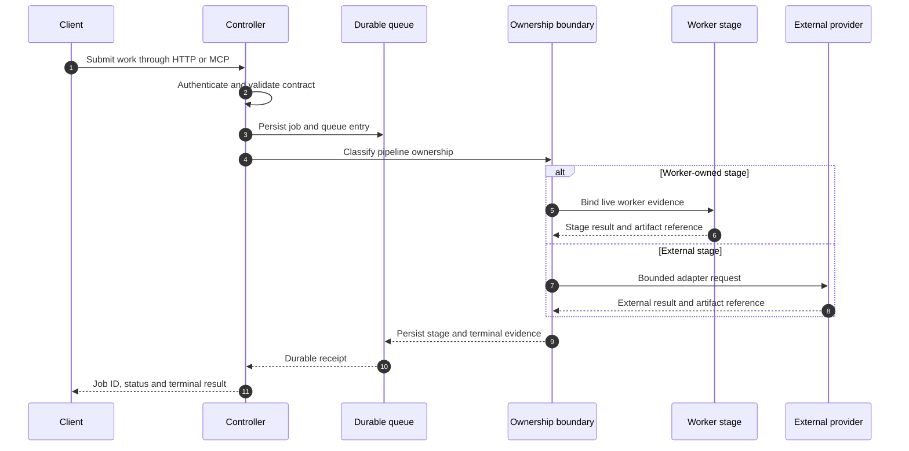
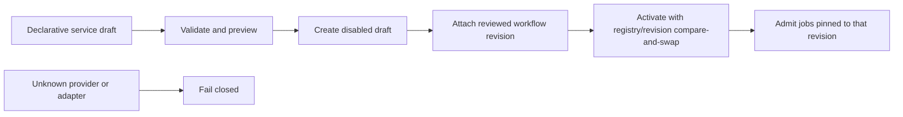

# GPUManager

[](https://github.com/carlkrott/gpu-manager-public/actions/workflows/ci.yml)
[](LICENSE)

GPUManager is a declarative control plane for coordinating services, durable jobs and GPU-oriented runtime lifecycles.

It gives clients one place to submit work, inspect health, manage queues and observe state while keeping service ownership, credentials, host execution policy and model placement outside the public source tree.

This repository is a source-only publication. It contains the control-plane software, neutral configuration fixtures, tests and release gates. It does not contain models, weights, production service definitions, host topology, credentials or deployment state.

## The short version

GPUManager connects five concerns without collapsing them into one unsafe launcher:

1. A protected controller API for clients, dashboards, WebSocket observers and MCP callers.
2. A durable queue and job ledger for admission, routing, cancellation, capacity and recovery.
3. A declarative pipeline boundary that distinguishes worker-owned stages from external providers.
4. A bundle lifecycle and runtime-supervisor boundary for checked start, drain, unload and recovery transitions.
5. A standalone broker for ordered model-service members, readiness, compatibility and durable dispatch.

The result is a control plane that can say “this work is admitted”, “this worker owns this stage”, “this runtime is ready” and “this job is terminal” as separate, inspectable facts.

## Architecture at a glance



The controller is the coordination point. It does not turn declarative input into arbitrary shell commands, host mounts, credentials or device assignments. Those belong to an operator-controlled runtime boundary.

## What the systems do

| System | Responsibility | Important boundary |
| --- | --- | --- |
| Controller | HTTP API, dashboard, WebSocket state, MCP surface, service admission and orchestration | Protected routes and explicit configuration; no implicit production registry discovery |
| Authentication policy | Bearer-token checks for HTTP and broker routes plus first-frame WebSocket authentication | Loopback compatibility is opt-in and disabled by default; forwarded headers are not trusted |
| Queue engine | Durable Redis/Valkey-compatible jobs, routing, slots, priorities, cancellation, capacity and dead-letter retention | Backend outages surface as errors; they are not silently treated as an empty queue |
| Bundle lifecycle | Desired state, readiness observations, recovery decisions, transition IDs and fencing | Service-agnostic reducer separates lifecycle decisions from host-specific execution |
| Pipeline compiler | Turns reviewed declarative operations into validated workflow graphs | GUI data cannot inject commands, shell, credentials, host mounts or devices |
| Execution boundary | Classifies worker-owned, external and mixed-ownership stages | Unknown providers fail closed; worker stages are not recursively resubmitted |
| Runtime host supervisor | Performs a small allowlisted set of checked runtime actions | Callers cannot supply arbitrary commands, units, paths, URLs, environments, mounts or devices |
| Combined Gemma broker | Ordered member topology, readiness, compatibility, durable dispatch and cancellation | GPUManager owns lifecycle mutation; candidate runtime rejects SSE and lifecycle mutation |
| Publication gates | Hash-bound manifest, privacy checker, source-closure tests, locked dependencies and secret scanning | Only explicitly listed release files are exportable |

## A request from admission to receipt



A successful HTTP response means that a request was accepted by the control plane. It is not, by itself, proof that the work completed or that an output passed quality review. Clients should follow the returned job identity to a terminal receipt.

## Core capabilities

### Controller and client surfaces

The controller brings several client views over the same coordination state:

- HTTP endpoints for health, service admission, generation submission, queues, jobs, bundles and operational state.
- An embedded dashboard for authenticated human operators.
- A WebSocket state stream with bounded first-frame authentication before application state is sent.
- A stdio MCP surface for tool-oriented clients.
- Explicit liveness access for health checks while sensitive reads and mutations remain protected.

The default bind is loopback. A wider bind does not disable authentication.

### Durable queues and job control

The queue engine provides the durable side of orchestration:

- job identity and terminal state;
- service routing and eligibility checks;
- priority and demand accounting;
- worker slots and capacity reporting;
- queued cancellation and bounded recovery;
- dead-letter retention with explicit purge authorization;
- Redis/Valkey connection timeouts and health checks;
- receipts that keep admission, execution and completion distinct.

The controller can coordinate GPU work without pretending that an unavailable queue backend is healthy or empty.

### Bundle lifecycle and recovery

A bundle is a service-level runtime unit whose desired state and observed readiness are managed together. The lifecycle reducer models states such as ready, recovering, crashed, faulted, maintenance and blocked, with bounded restart windows and transition fencing.

This keeps decisions such as “should this bundle be probed, started, restarted or quarantined?” separate from the host-specific mechanism that performs the action.

### Declarative workflow registration

A service draft can describe reviewed inputs, operations and outputs. The compiler validates that description into a workflow graph and bounded preview.

Declarative registration cannot provide:

- shell or executable commands;
- arbitrary URLs or provider adapters;
- credentials or tokens;
- host mounts, Docker sockets or host networking;
- GPU/device assignments;
- systemd units, model paths or environment overrides.

A safe registration lifecycle is:



### Worker, external and mixed ownership

Every pipeline stage has an explicit provider and execution owner:

- `worker` stages bind to live worker evidence and are not sent back through the same queue.
- `external` stages use a bounded HTTP/provider adapter.
- mixed pipelines use an explicit handoff that carries worker evidence into the external portion.
- unknown providers or missing ownership metadata fail closed.

This prevents recursive queue submission and makes the execution boundary visible in the job evidence.

### Combined Gemma broker

The standalone broker is a separately composable service for an ordered set of model-service members. It provides:

- strict member configuration and ordering;
- semantic readiness rather than TCP-only readiness;
- compatibility and capability evaluation;
- durable job submission, status and cancellation;
- leadership fencing so only one dispatcher owns a namespace;
- Redis-backed or in-memory repository implementations;
- clean shutdown and recovery behavior;
- a candidate-mode contract that disables lifecycle mutation and SSE.

The public example uses disabled synthetic members and an isolated candidate namespace. It is a schema and behavior fixture, not a live model deployment.

### Checked runtime supervision

The host-supervisor boundary accepts only known actions such as inspect, prepare, load, drain, unload, stop, health and reconcile. Runtime profiles, model-set identities and transition fences are validated before a host action is accepted.

The supervisor does not accept arbitrary process commands, systemd units, URLs, paths, environment variables, mounts or device identifiers from a client request. Those values belong to reviewed operator configuration outside this repository.

## Security model

The default posture is deliberately conservative:

- protected HTTP reads and all mutations require a bearer token;
- tokens are read from an operator credential-file boundary, not source, URL, cookie or browser storage;
- WebSocket clients authenticate before joining state broadcasts;
- loopback unauthenticated compatibility is an explicit opt-in and is disabled in the examples and CI;
- the standalone broker uses the same authentication policy as the controller;
- configuration paths must be supplied explicitly;
- public examples contain no real services, credentials, models or host state;
- secret scanning, push protection, dependency alerts and protected `main` are enabled on the published repository.

For deployment-specific hardening, review `SECURITY.md` and keep the real registry, credential files, runtime overlay and service-manager configuration outside this repository.

## Quickstart: inspect and verify the source

Python 3.11 or newer is required. The hash-locked install is validated for CPython 3.14 on the GitHub-hosted `ubuntu-24.04` x86_64 runner.

```bash
python3 -m venv .venv
.venv/bin/python -m pip install --require-hashes --no-deps -r requirements-dev.lock
```

Run the source-only test suite:

```bash
PYTHONPATH=scripts .venv/bin/python -m pytest -q tests/publication
```

Run the public payload gate:

```bash
PYTHONPATH=scripts .venv/bin/python scripts/check_public_payload.py .
```

Inspect CLI surfaces without starting a service:

```bash
.venv/bin/python scripts/gpu-manager.py --help
.venv/bin/python scripts/combined_gemma_broker_service.py --help
```

The lock files install Python packages only. They do not download models, start services or configure a host.

## Safe examples

The empty registry is the smallest neutral configuration. Validate it without starting anything:

```bash
python3 -m json.tool examples/empty/services.json
```

The fixture-only Combined Gemma broker demonstration exercises validation, member health, queuing, cancellation and terminal completion without Redis, systemd, Docker, GPUs, models, internet access or production services:

```bash
python3 examples/combined-gemma/demo.py --dry-run
python3 examples/combined-gemma/demo.py --mock-demo
```

Every event in the mock run is labelled as simulated, and the result explicitly says that no model output was generated.

## Configuration and deployment boundary

A clean checkout starts with no configured workload. Real deployments provide an operator-owned registry and runtime boundary separately.

Keep these outside the public repository:

- real service definitions and endpoints;
- model paths, weights and model hashes;
- hostnames, network topology and device assignments;
- systemd units, runtime overlays and process arguments;
- credential files, tokens and Redis passwords;
- job state, generated results and operational evidence.

The broker has no implicit configuration-file discovery. Supply `--config` or `GPU_MANAGER_CONFIG_PATH` explicitly, then review endpoint ownership and lifecycle policy before enabling a service.

## Repository map

| Area | What to look at |
| --- | --- |
| `scripts/gpu-manager.py` | Controller, API, dashboard, WebSocket state and MCP composition |
| `scripts/api_auth.py` | Shared HTTP and WebSocket authentication policy |
| `scripts/queue_engine.py` | Durable queues, jobs, slots, routing and dead letters |
| `scripts/bundle_lifecycle.py` | Pure lifecycle/recovery decisions and fencing contracts |
| `scripts/gemma_broker/` | Broker configuration, contracts, repositories, readiness and runtime |
| `scripts/declarative_workflow_registration.py` | Safe declarative draft compilation |
| `scripts/execution_boundary.py` | Worker/external ownership classification and fail-closed dispatch |
| `scripts/runtime_host_supervisor.py` | Allowlisted host-runtime action boundary |
| `examples/` | Empty and Combined Gemma neutral fixtures |
| `tests/publication/` | Hermetic auth, isolation, portability, source-closure and payload tests |
| `release/` | Committed path/disposition allowlist and generated exact-byte release receipt |

## Publication and contribution checks

The public release is bound to `release/public-files.json`, a committed path/disposition allowlist. The exporter rejects files outside that allowlist and generates `release/export-manifest.json` as an exact-byte SHA-256/size receipt. The payload checker verifies the receipt and rejects private paths, credentials, model artifacts, archives and unsupported binary content.

For manifest-affecting changes:

1. Update the path/disposition allowlist only when the public file set changes; do not hand-edit receipt hashes or sizes.
2. Export to a new destination, which generates a fresh exact-byte receipt.
3. Re-run the payload checker against the exact export and its receipt.
4. Run the publication tests and secret scanner.
5. Review the staged tree before committing.

See `CONTRIBUTING.md` for contribution expectations and `SECURITY.md` for vulnerability reporting guidance. CI repeats the source-only checks on every change.

## Scope and limitations

This repository documents and tests the control-plane software. It does not claim:

- internet readiness for an operator deployment;
- GPU or model qualification;
- model quality or generated-media quality;
- production service health;
- a particular hardware topology;
- a complete deployment recipe for a host.

Those claims require a separately reviewed operator configuration and environment-specific qualification.

## License

This project is licensed under the MIT License; see `LICENSE`. Dependency and workflow terms are documented in `THIRD_PARTY_NOTICES.md`. Model, model-weight, private-workflow and production-service licenses are not redistributed or implied.
